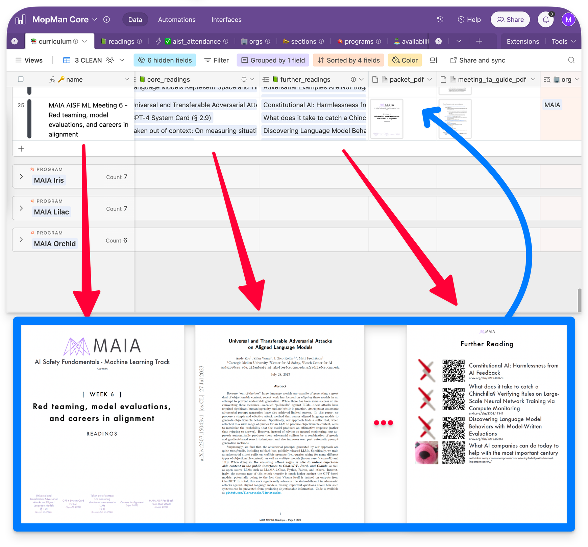
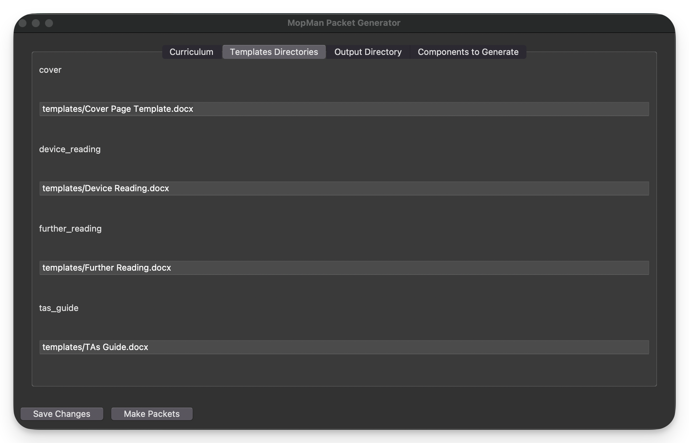
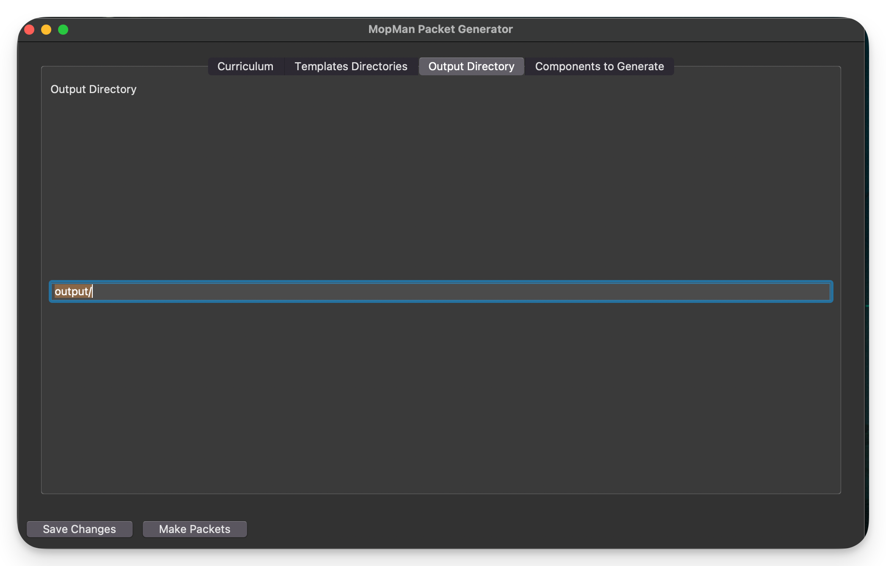
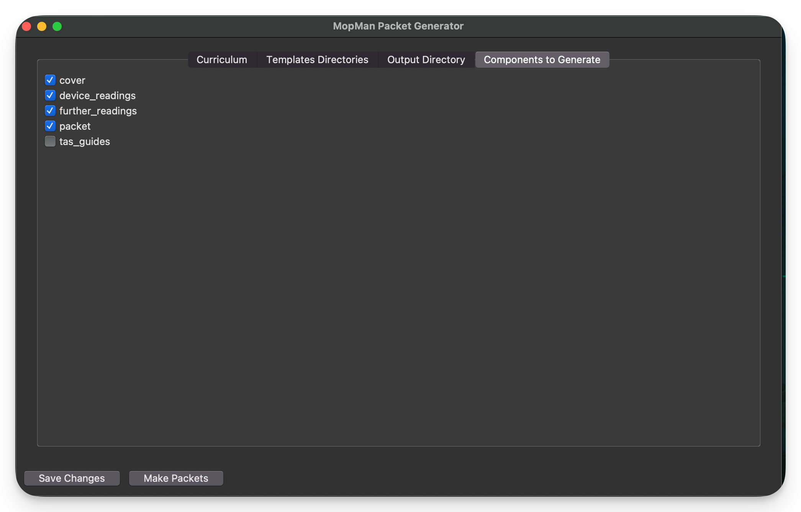

# homebrew-mopman


> [!WARNING]
> This is currently

<div align="center">
  
  
</div>

Gatlen Culp is currently making sexy packets for AI Safety Fundamentals (both policy and technical), internal member meetings, hackathons, etc. for Columbia, MIT, and Harvard using a program I wrote. Read more [here](https://www.notion.so/gatlen/MopMan-PacketMaker-a62ed64c69f2440bbde8b0212de773df?pvs=4)

I turn each meeting in the curriculum document into an airtable record and run my program to make packets. This program is not ready for distribution so if you want me to make these, I can. Just send me your curriculum and I can make them for the semester.

There are a few benefits of the packets

1. They are sexy fr fr
2. If you have a printer with a built-in stapler, you can just set the number of copies and hit go.
3. For readings meant to be read online, it generates a QR code, link, and place to take notes.
4. Makes a single nice page of links and QR codes for optional/further readings
5. There is a global page number across the packet. Instead of telling your readers “go to page 4 of the ELK paper which is after the x paper and before the y paper” you can just say “go to page 14 of the packet”
6. No need to fiddle with HTML and print settings to get the proper look for your readings since this has already been done and uploaded.
7. Easily distribute the PDF to readers that were not able to attend

See the original repo [here](https://github.com/GatlenCulp/MopMan_Packetmaker)






<div align="center">
  
</div>


*[Homebrew ("brew")](https://brew.sh/) is a macOS (and Linux) package manager. New contributers to this Homebrew formulae (especially those new to Homebrew formula development) should see [CONTRIBUTING.md](./CONTRIBUTING.md).*

---
## 00 TOC

- [homebrew-mopman](#homebrew-mopman)
  - [00 TOC](#00-toc)
  - [01 Installation](#01-installation)
  - [02 Uninstalling](#02-uninstalling)
  - [03 Updating and Reinstalling](#03-updating-and-reinstalling)
  - [04 Known Issues](#04-known-issues)
  - [05 Contact the Maintainer](#05-contact-the-maintainer)

---
## 01 Installation

**01. Tap this repository**
```bash
brew tap GatlenCulp/mopman
```

**02. Install MopMan**
```bash
brew install mopman
```
---
## 02 Uninstalling

To uninstall, run:
```bash
brew uninstall mopman
```

---
## 03 Updating and Reinstalling

To update MopMan to the latest version:

**1. Update the Homebrew formulae**
```bash
brew update
```

**2. Upgrade MopMan**
```bash
brew upgrade mopman
```

---
## 04 Known Issues

---
## 05 Contact the Maintainer

Gatlen Culp, MAIA Executive Board Member, Former Operations Director \
Email: gatlen.culp@metr.org \
Portfolio: [gatlen.notion.site](https://gatlen.notion.site)